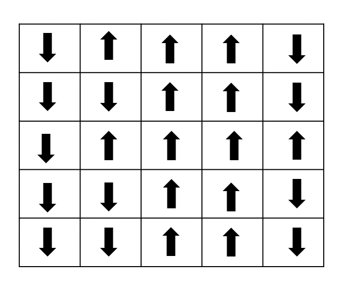
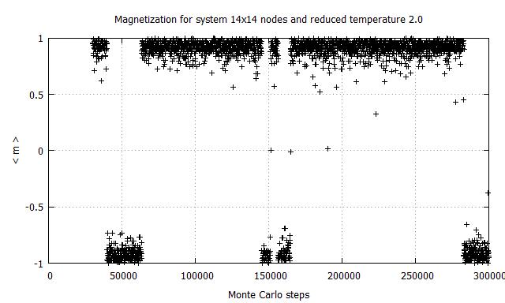
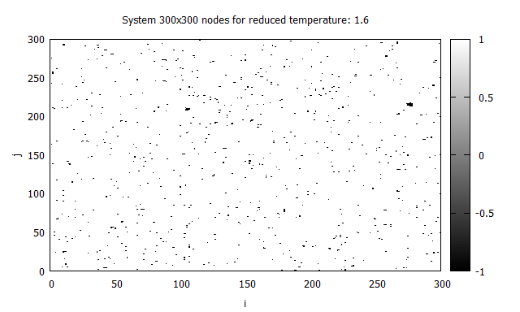
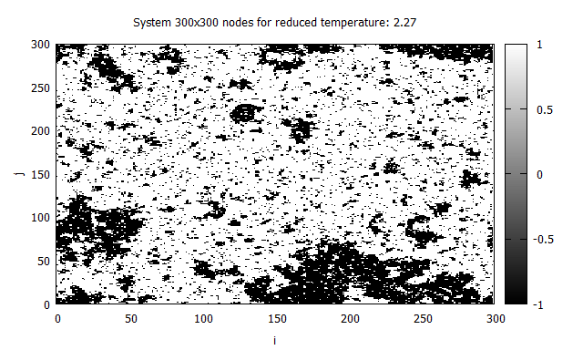
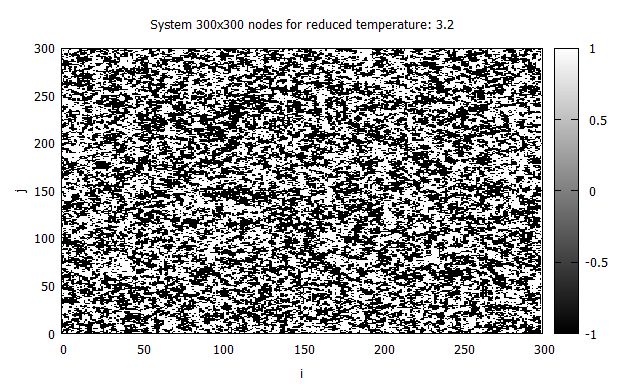

# Two-dimensional Ising model (Monte Carlo Simulation)

# Ising model: general info
It's a simple model of ferromagnetism (in dependence of Hamiltonian: 
ferromagnetic or antiferromagnetic). Each node (spin) of the two-dimensional network has a value s, where
value of s can be equal +1 or −1 (spin - up or spin - down)  

  

# Monte Carlo Simulation

# Results

  

  

  

  

# Run 
main.f in dependence of choosen loop return 
* table (size L x L) of nodes, where value of nodes +-1
* system magnetization and < magnetization > 
* magnetic susceptibility
* heat capacity
* Binder cumulant
