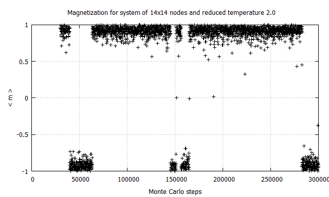

# Two-dimensional Ising model (Monte Carlo Simulation)

# Ising model: general info
It's a simple model of ferromagnetism (in dependence of Hamiltonian:
ferromagnetic or antiferromagnetic). Each lattice site (spin) has a value +1 or −1 (***spin-up*** or ***spin-down***)  

  

# Results
It's results for ferromagnetic model. It means that in low temperature,
there is more probability for spins with the same direction.
When temperature is more than the critical temperature (Tc = 2.27), the system is in a paramagnetic stage
(the same and opposite values ​​in neighboring spinss occur with equal probability). 

  

  

  

  

# Monte Carlo Simulation
In the Monte Carlo method, Metropolis algorithm is used:
1. energy of initial configuration
2. energy of new configuration (in our case change spin direction)
3. the energy difference between ***1*** and ***2***
4. if ***3*** < 0 then accept new configuration (energy of the new configuration is smaller)
* else if *random number* <= exp(−([2] − [1])/kT) then accept the new configuration
* else reject the new configuration

# Run
***main.f*** calculates magnetization of the system and saves configuration from last MC step

# Technologies
Main project (***main.f***) is created with Fortran 95  
Additionaly, ***main.vi*** is code in LabVIEW.
